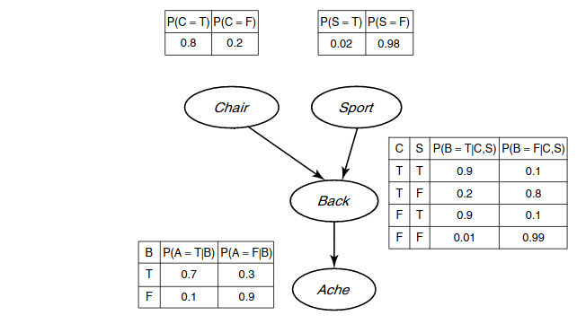

# [WSI] - ćwiczenie 7

## Treść zadania
Proszę zaimplementować losowy generator danych, który działa zgodnie z rozkładem reprezentowanym przez daną sieci bayesowską.

Sieć ta opisuje zależności między (zero-jedynkowymi) zmiennymi losowymi i dana jest w postaci opisu grafu połączeń oraz tabel prawdopodobieństw warunkowych. Wejście algorytmu: ile przykładów wygenerować, opis struktury prostej sieci (według własnego formatu) oraz tabele prawdopodobieństw należy wczytać z pliku tekstowego. Wyjście: plik tekstowy z przykładami. Strukturę sieci i tabele prawdopodobieństw widać na rysunku. Klasa to „Ache” (czy bolą plecy), pozostałe węzły to atrybuty („Back” to uszkodzenie kręgosłupa (drobne, czasem nie skutkujące bólem)). Wytworzony zbiór podzielić i użyć do treningu i testowania klasyfikatora utworzonego na wcześniejszych ćwiczeniach. Jakie uzyskuemy wyniki? Wnioski?

# Dokładność i macierz pomyłek

## Ache

Liczba rekordów: `10000`\
Liczba zmiennych: `3`

expected / predicted | positive | negative
---------------------|----------|---------
positive             | 248.25   | 107.05
negative             | 161.9    | 1482.8

AVG: `0.86673`

# Wnioski

Jako wejście program otrzymuje plik `JSON`, w którym zawarte są kolejne węzły modelu. Każdy węzeł zawiera takie parametry jak: Nazwa, Rodzice (węzły, od których jest zależny) oraz Prawdopodobieństwa (tylko zdarzenia pozytywne, ponieważ przeciwne możemy wyliczyć z definicji prawdopodobieństwa).

Na Wyjściu programu otrzymujemy plik `.data`, dla każdego węzła obliczamy prawdopodobieństwo i sprawdzamy, czy jest ono mniejsze niż podane i zapisujemy do pliku.

